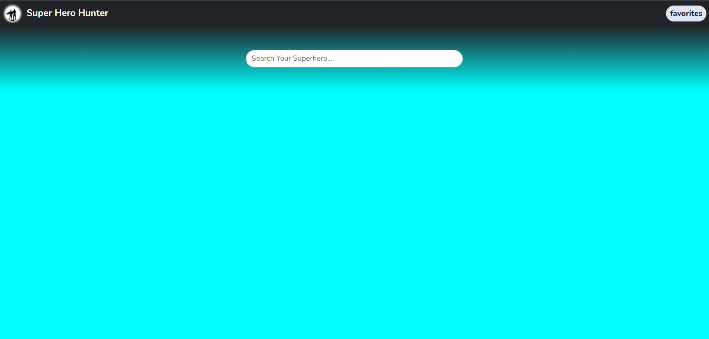
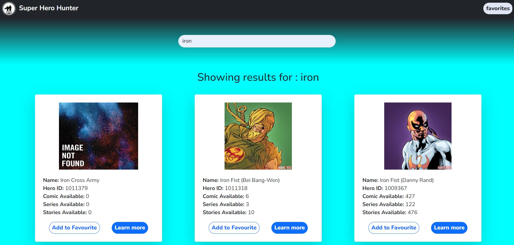
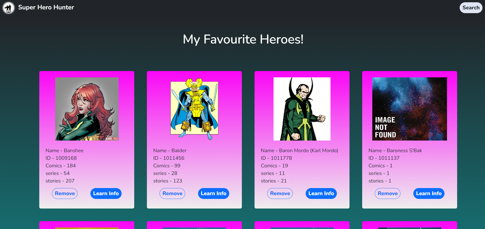
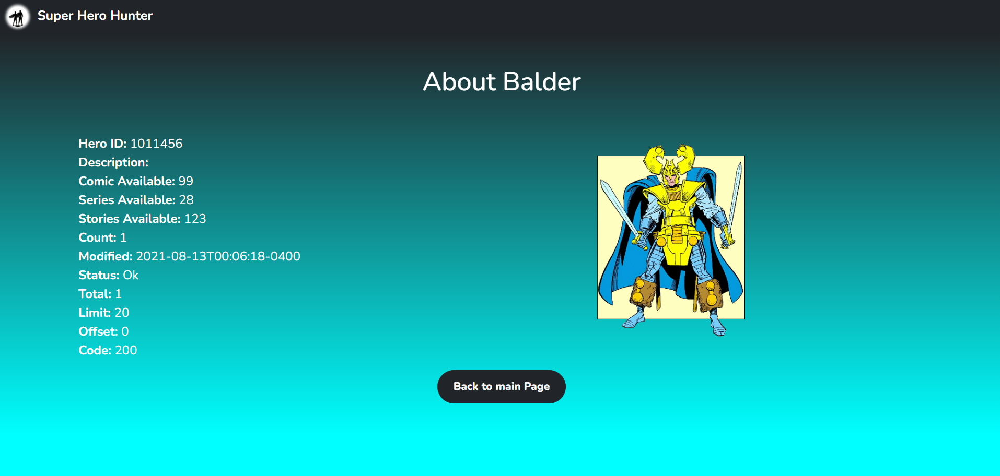

# SUPER HERO HUNTER

It is  Coding Ninjas Skill Test Project for Front-End. Please visit the Coding Ninjas website [CodingNinjas ](https://www.codingninjas.com/) for more details.

## Table of contents

- [Overview](#overview)
  - [Screenshot](#screenshots)
  - [Built with](#built-with)
- [Author](#author)
- [Acknowledgments](#acknowledgments)
- [Deploy Link](#deployed-link)

## Overview

🔴 This is a front-end Super Hero hunter project. 
🔴 It has very similar features to a browsing website. 
🔴 For this project i have fetched data from marvel superheroes API. 
🔴 You have to search for any super hero, and the list of super heroes will be shown on the screen. 
🔴 You can also read more details about any of the super hero as well as you can add any no of them to your favourite list. 
🔴 The favourite list will be saved on your local storage, so even after refreshing or reloading the page at any time you can see the faourite list you have saved. 
🔴 You can also remove any particular superhero from your favourite list.

### Screenshots
🔴 This is Searching Page 
  
🔴 These are the results shown according to your search querry 
  
🔴 This is your Favourites List 
 
🔴 This is your About info page for any pareticular Super hero 
 

### Built with

- HTML
- CSS
- JavaScript

## Author

- Github - [Subha Biswal](https://github.com/20SB)

## Acknowledgments

This project is done by me from scratch by referring to google and coding ninja.

## Deployed Link
-[SUPER HERO HUNTER](https://super-hero-hunter-subha.netlify.app/)
